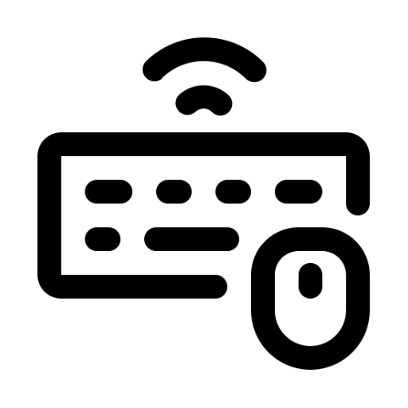

# 🖱️ Freemouse

> **Cross-platform mouse, keyboard, and clipboard sharing — encrypted, self-hosted, and free.**



Freemouse lets you control multiple computers from a single mouse and keyboard over your local network. Move your cursor to the edge of the screen and it seamlessly jumps to the next machine — like a software KVM switch. All traffic is end-to-end encrypted.

---

## ✨ Features

- **🔀 Seamless cursor switching** — Move your mouse to the right screen edge to take control of a remote machine; move left to return
- **⌨️ Full keyboard forwarding** — Keys, modifiers (Ctrl, Alt, Shift, Meta), function keys, numpad — all mapped and forwarded
- **🖱️ Mouse support** — Left, right, middle button clicks, movement, scrolling
- **📋 Clipboard sync** — Copy text on one machine, paste on the other (echo-prevention built in)
- **🔒 Encrypted by default** — ChaCha20Poly1305 AEAD with Argon2 key derivation from a 6-digit PIN
- **🔍 Auto-discovery** — No need to type IP addresses; machines find each other automatically via UDP broadcast
- **🌐 Cross-platform** — Windows, macOS, and Linux (Wayland & X11)
- **🎨 Clean dark-mode GUI** — Built with egui, minimal and responsive
- **⏱️ Connection timeout** — 10-second timeout on connections with clear error messages
- **💓 Keep-alive pings** — Automatic disconnect detection every 2 seconds
- **📦 No cloud, no accounts** — Pure peer-to-peer, no third-party servers

---

## 🖼️ Screenshots

| Home                                             | Share Mode                                 | Receive Mode                                        |
| ------------------------------------------------ | ------------------------------------------ | --------------------------------------------------- |
| Share & Receive buttons, screen resolution shown | IP & PIN displayed, waiting for connection | Manual IP/PIN entry or pick from discovered servers |

---

## 🚀 Quick Start

### Prerequisites

- **Rust 1.75+** (install via [rustup](https://rustup.rs/))
- Platform-specific dependencies (see below)

### Build & Run

```bash
# Clone and build
git clone https://github.com/yourusername/freemouse
cd freemouse
cargo run --release
```

### Platform Prerequisites

#### 🪟 Windows

- Visual Studio Build Tools or MSVC
- The `FreeMouse.ico` is automatically embedded into the `.exe`

#### 🍎 macOS

- Xcode Command Line Tools: `xcode-select --install`
- Accessibility permissions (granted on first `grab` call)

#### 🐧 Linux

**For input capture (evdev):**

```bash
# Add your user to the input group for /dev/input/event* access
sudo usermod -a -G input $USER
# Log out and back in for group changes to take effect
```

**For input simulation (uinput):**

```bash
# Add your user to the uinput group
sudo usermod -a -G uinput $USER
# Or run with sudo (not recommended for daily use)
```

**Arch Linux dependencies:**

```bash
sudo pacman -S base-devel
```

**Ubuntu/Debian dependencies:**

```bash
sudo apt install build-essential libx11-dev libxtst-dev
```

---

## 🎮 How to Use

### Share Mode (Server)

1. Click **📤 Share**
2. Note the displayed **IP Address** and **6-digit PIN**
3. Tell the receiving machine's user to enter these details
4. When they connect, the status changes to "Connected!"
5. Move your cursor **off the right edge** of the screen to take control of the remote machine
6. Move it **back to the left edge** to return control locally

### Receive Mode (Client)

1. Click **📥 Receive**
2. Wait for nearby share machines to appear in the "Discovered servers" list, **or**
3. Manually enter the IP address and PIN shown on the share machine
4. Click **🔗 Connect**
5. Once connected, you'll see "Connected Successfully!"
6. The remote mouse, keyboard, and clipboard will now control your machine when the share machine switches to remote mode

---

## 🔒 Security

Freemouse uses **end-to-end encryption** for all communication:

| Component             | Algorithm                                 |
| --------------------- | ----------------------------------------- |
| **Key derivation**    | Argon2id (memory-hard, PIN → 256-bit key) |
| **Encryption**        | ChaCha20Poly1305 (authenticated AEAD)     |
| **Per-message nonce** | Random 96-bit nonce per frame             |
| **Authentication**    | PIN-based (6 digits, ~1M combinations)    |

The 16-byte salt is exchanged in plaintext during the handshake. All subsequent traffic is encrypted and authenticated.

**Note:** The PIN provides basic access control — choose a strong PIN for sensitive environments.

---

## 🏗️ Architecture

```
┌─────────────────────┐          TCP/4444          ┌─────────────────────┐
│   SHARE MACHINE     │◄─────────────────────────►│  RECEIVE MACHINE    │
│   (Server)          │    Encrypted tunnel        │  (Client)           │
│                     │                             │                     │
│  ┌───────────────┐  │   Forwarded events:        │  ┌───────────────┐  │
│  │ Input Capture │──┤   • MouseMove(x, y)        ├──│ Input Simulate │  │
│  │ (rdev/evdev)  │  │   • MouseButton(btn, dir)  │  │ (enigo/uinput) │  │
│  └───────────────┘  │   • KeyDown/Up(keycode)   │  └───────────────┘  │
│                     │   • ClipboardText(text)    │                     │
│  ┌───────────────┐  │   • KeepAlive              │  ┌───────────────┐  │
│  │ Clipboard     │──┤                             ├──│ Clipboard     │  │
│  │ Monitor       │  │   Clipboard sync is         │  │ Monitor       │  │
│  └───────────────┘  │   bidirectional             │  └───────────────┘  │
└─────────────────────┘                             └─────────────────────┘

         UDP/4446 (Broadcast): Discovery packets
```

### Key Components

| Module             | Purpose                                            | Technology                            |
| ------------------ | -------------------------------------------------- | ------------------------------------- |
| `src/main.rs`      | GUI, app state, mode management                    | egui/eframe                           |
| `src/network.rs`   | TCP server/client, encryption, protocol, discovery | tokio, ChaCha20Poly1305               |
| `src/capture.rs`   | Input capture & simulation (platform-specific)     | rdev/enigo (Win/macOS), evdev (Linux) |
| `src/clipboard.rs` | Clipboard polling & sync with echo prevention      | arboard                               |

### Network Protocol

1. **Handshake:** Server sends 16-byte random salt → Client receives → both derive key via Argon2
2. **Framing:** `[4-byte frame length][12-byte nonce][encrypted payload (bincode-serialized)]`
3. **Events:** Typed enum over the wire — `MouseMoved`, `KeyDown`, `ClipboardText`, `KeepAlive`, etc.
4. **Keep-alive:** Both sides send `KeepAlive` every 2 seconds; connection drops on failure
5. **Discovery:** UDP broadcast `b"FMDS"` + IP + hostname every 2 seconds on port 4446

---

## 🛠️ Development

```bash
# Build in debug mode
cargo build

# Build with optimizations
cargo build --release

# Run
cargo run

# Run with logging
RUST_LOG=debug cargo run

# Lint
cargo clippy

# Format
cargo fmt
```

### Project Structure

```
freemouse/
├── src/
│   ├── main.rs          # Entry point, GUI, mode state machine
│   ├── network.rs       # TCP, encryption, discovery, protocol
│   ├── capture.rs       # Platform-specific input + simulation
│   └── clipboard.rs     # Clipboard monitoring & sync
├── build.rs             # Windows icon embedding
├── FreeMouse.ico        # Windows application icon
├── FreeMouse.png        # Project logo (512x512)
└── Cargo.toml           # Dependencies & metadata
```

---

## 📦 Dependencies

| Crate               | Version   | Purpose                        |
| ------------------- | --------- | ------------------------------ |
| `eframe`            | 0.27      | GUI framework (egui)           |
| `tokio`             | 1.37      | Async runtime                  |
| `serde` + `bincode` | 1.0 / 1.3 | Serialization                  |
| `argon2`            | 0.5       | Key derivation                 |
| `chacha20poly1305`  | 0.10      | Authenticated encryption       |
| `rdev`              | 0.5       | Input capture (Win/macOS)      |
| `enigo`             | 0.2       | Input simulation (Win/macOS)   |
| `evdev`             | 0.12      | Input capture + uinput (Linux) |
| `arboard`           | 3.4       | Clipboard access               |
| `rand`              | 0.8       | Cryptographically secure RNG   |
| `local-ip-address`  | 0.6       | IP address detection           |
| `tracing`           | 0.1       | Structured logging             |
| `hostname`          | 0.4       | Machine name for discovery     |

---

## 🤝 Contributing

Contributions are welcome! Please feel free to submit a Pull Request.

1. Fork the repository
2. Create your feature branch: `git checkout -b feature/amazing-feature`
3. Commit your changes: `git commit -m 'Add amazing feature'`
4. Push: `git push origin feature/amazing-feature`
5. Open a Pull Request

### Roadmap

- [ ] **File drag-and-drop** between machines
- [ ] **Multi-monitor support** — arrange monitors in a grid
- [ ] **Scroll lock toggle** — lock cursor to current screen
- [ ] **Customizable port** — configure port via UI
- [ ] **Persistent screen layout** — save monitor arrangement
- [ ] **Wayland native support** — improved Linux wayland support

---

## 🙏 Acknowledgments

Freemouse is built on the shoulders of giants:

- **[Barrier](https://github.com/debauchee/barrier)** / **[Input Leap](https://github.com/input-leap/input-leap)** / **[Deskflow](https://github.com/deskflow/deskflow)** — The open-source KVM pioneers that inspired this project
- **rdev** — Cross-platform input event capture
- **enigo** — Cross-platform input simulation
- **egui/eframe** — Immediate-mode GUI framework
- **evdev** — Linux input subsystem access

---

## 📄 License

This project is licensed under the MIT License — see the LICENSE file for details.

---

<p align="center">
  Made with ❤️ for the open-source community
</p>
